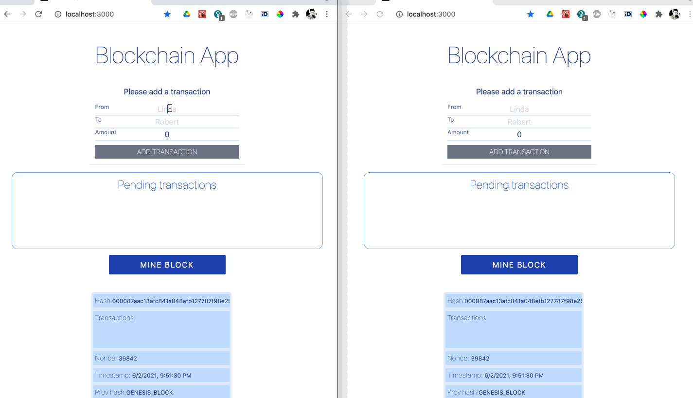

# simple-blockchain
A blockchain app, in which nodes communicate through websocket server. Developed mostly in TDD way.



## File structure

 - `client`: Blockchain node. Created with Create-React-App. Contains mining and hashing logic.
 - `server`: A WebSocket server. Acts as a mediator between nodes.

## Installation

To run the app, run these commands in two separate terminal windows:
```bash
cd server && npm i && npm run dev
```

and 

```bash
cd client && npm i && npm start
```

